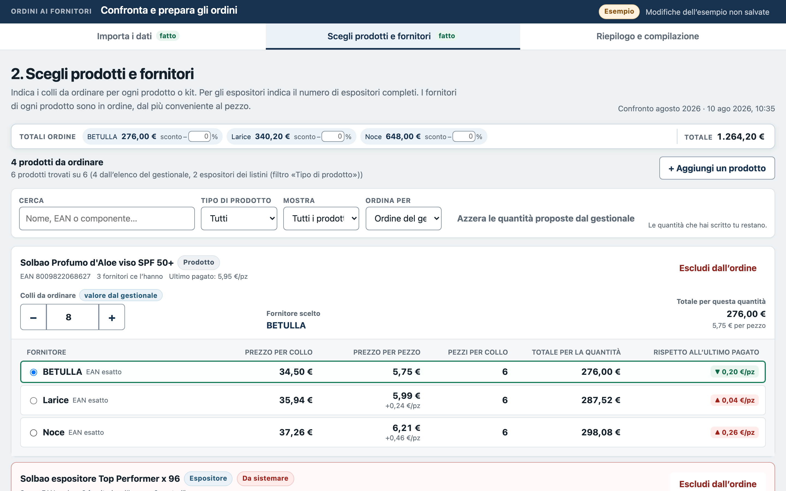
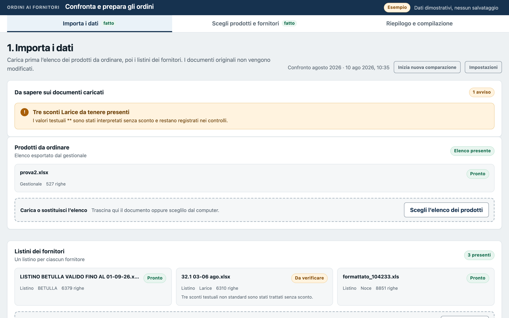
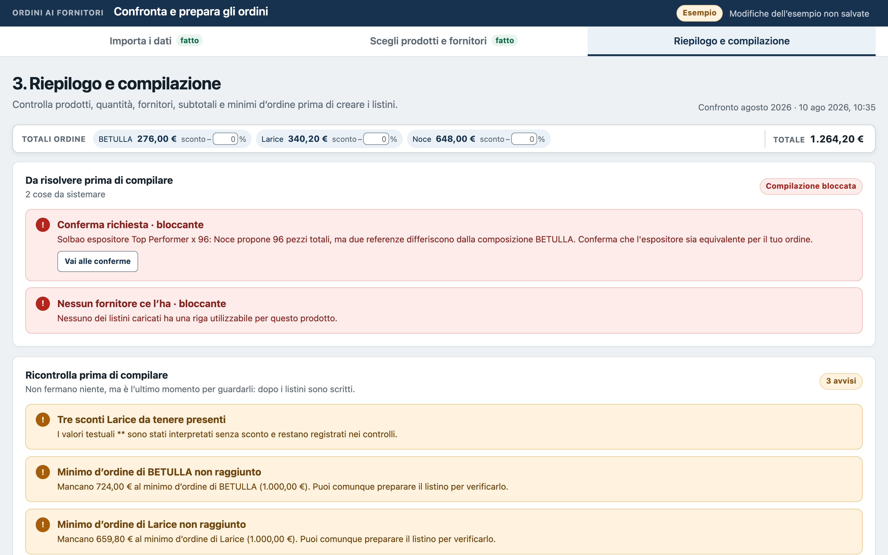
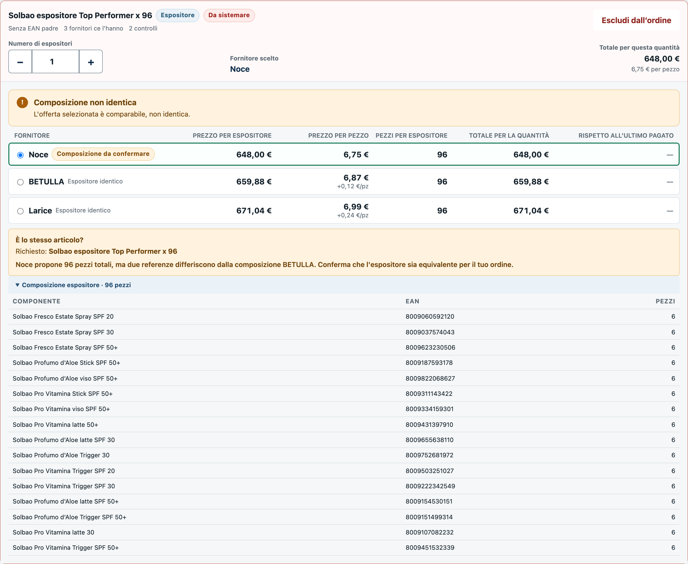

# Supplier Order Comparator

A local web app that turns a retail store's weekly purchasing round into a reviewed, auditable decision: it reads the store's reorder list and every supplier's price list (each in its own format), picks the cheapest supplier for every item, and writes the order quantities **back into each supplier's own Excel file**, leaving everything else in the file untouched.

Built for a real household & personal-care store, where it is in weekly production use on a Windows PC run by a non-technical user.

**At a glance**

- **Problem:** several wholesalers' price lists (`.xlsx`, legacy `.xls`, `.csv`, thousands of rows each, every one with its own layout) had to be compared by hand against the store's reorder list every week, and the orders retyped into each supplier's own spreadsheet.
- **Solution:** a registry of per-supplier adapters, a deterministic nine-phase pipeline, an LLM used only on ambiguous product matches and checked by an adversarial second pass, and a writer that fills in each supplier's original file.
- **Result:** in weekly production use, about 460 products per comparison across nine file schemas, AI spend measured in cents, and about 2,400 automated tests with CI on Windows.



> Supplier names, products, barcodes and prices in this repository are fictional or anonymized. The UI, the identifiers and the LLM prompts are in Italian, the language of the people who use the tool; comments and documentation are in English.

---

## The problem

Every week the store reorders a few hundred products from several wholesalers. Before placing orders, someone has to answer one question for every product: *who sells it cheapest this week?*

The data is spread across files that were never meant to be compared:

- **The reorder list** comes out of the store's management software as an Excel export: EAN barcodes, descriptions and quantities.
- **Each wholesaler sends its own price list**: `.xlsx`, legacy `.xls` (Excel 97-2003) or `.csv`, with thousands of rows each. They differ in column names and order, header rows, sheet layout, price basis (per piece or per carton), pack sizes, and how promotions are written ("buy 10 cartons, get 1 free" as free text inside a description).
- **The same product shows up differently across suppliers**: an EAN in one list, a slightly different description and no EAN in another, or bundled inside a *display* (a mixed carton of 66 or 96 pieces from several SKUs) that has no barcode of its own.
- **Rows move every week.** In one measured case, 6,023 of 6,023 items in a supplier's list sat on a different row than the week before, so "same row as last time" can't be used to identify a product.
- **Orders go back as the supplier's own file.** Each wholesaler expects its price list returned with the quantity column filled in, not a new spreadsheet.

Done by hand, this means cross-referencing thousands of rows by eye, working out pack prices, and retyping quantities into several differently shaped spreadsheets, every week. A wrong match isn't a wrong number on a screen: it's a wrong order.

## The solution

A Python service with a vanilla-JS interface, running on `127.0.0.1` only. It never sends an order and never modifies an original file. It works on copies and leaves the final send to a person.

### 1. A registry of per-supplier adapters

Each known file format is described by an **adapter** in [`references/adapters.json`](references/adapters.json), not hard-coded in the parser. An adapter declares how to recognize the file (a header signature, or a column-shape signature for files with no header row), which column is what, the commercial rules (price basis, how a line total is computed, where promotions live), and **where the order quantity has to be written back**:

```jsonc
{
  "id": "betulla_v1",
  "kind": "supplier",
  "file_types": [".xlsx"],
  "header_signature": { "header_row": 1, "data_start_row": 2,
                        "columns": { "ean": 1, "codart": 2, "ordine": 3, "cessione": 6 }, "...": "..." },
  "header_aliases":   { "unit_price_net": ["Cessione"], "pieces_per_carton": ["PzCt", "Pz Ct"], "...": "..." },
  "commercial_rules": { "price_basis": "net_unit",
                        "line_total": "order_quantity * pieces_per_carton * unit_price_net" },
  "order_write":      { "sheet": "FIRST", "order_column": "C", "expected_header": "ORDINE" }
}
```

The repository ships nine adapters: the management-software export, several wholesalers (one of them with two list layouts, one sending both `.xls` and `.csv`), and a header-less promotional sheet recognized by the shape of its columns. When a file matches no adapter, the UI walks the user through mapping its columns. The result is saved as a **learned adapter** and used deterministically from then on.

### 2. A nine-phase pipeline, deterministic first


Every run works in its own dated folder, and the live comparison is swapped only when the last phase succeeds. If a phase fails, the previous comparison stays in place and the UI reports which phase stopped and why. If the AI phase can't run (no key, spending cap reached, network down), the pipeline finishes in a declared *degraded* state instead of guessing.

The line between code and model is explicit ([`references/decision-boundaries.md`](references/decision-boundaries.md)):

| Deterministic | AI-assisted | Human |
|---|---|---|
| file recognition, full-sheet scanning, EAN normalization and matching, prices, discounts, VAT, pack sizes, totals, minimum-order thresholds, writing | judging whether a shortlisted candidate is *commercially the same product* when no EAN matches (brand, size, variant) | confirming AI matches below high confidence, choosing quantities, sending orders |

### 3. Semantic matching: a deterministic shortlist, the model only as judge

EAN barcodes settle most products. The rest (no EAN in the supplier's list, or one EAN on several rows) go through three stages with deliberately narrow jobs ([`references/matching-policy.md`](references/matching-policy.md)).

**Shortlist, in code.** [`scripts/build_semantic_shortlists.py`](scripts/build_semantic_shortlists.py) normalizes descriptions (uppercase, accents stripped, stop words removed, aliases such as `DEODORANTE → DEO`), pulls candidates from a per-supplier inverted token index and ranks them with a fixed formula:

```
score = 0.45 · token Jaccard + 0.35 · sequence similarity + 0.20 · size/pack agreement
        − 0.35 when the sizes or pack counts conflict
```

Sizes and pack counts come from a hand-written parser that reads both `500 ML` and `ML.500`, `18PZ` and `X 18`, and deliberately ignores what it could misread (weight ranges, size grades like `5°MIS.`, formulas like `2X13=26`, ages): a false conflict penalizes exactly the right row, while an unread number changes nothing. Every row that shares the item's EAN is forced into the shortlist, because on 1,160 cases with a known answer, description scoring alone missed the right row 146 times.

**Judgment, by the model.** [`app/ai_client.py`](app/ai_client.py) sends each case with its shortlist to a model on OpenRouter (chosen in the settings), which answers `ACCEPT`, `REJECT` or `UNRESOLVED` for one candidate under a strict JSON schema. The model never searches the catalog and never sees EANs or prices: only descriptions and scores. It can reject every candidate, and `DA_VERIFICARE` ("to be checked") is a legitimate outcome, never forced into a guess.

**Safeguards around the answers:**

- **An adversarial second pass** tries to refute every acceptance before it counts ([`references/prompts/`](references/prompts)).
- **A case fingerprint.** Each decision carries a hash of exactly what the model saw (item plus every candidate, in order). The merge step ([`scripts/merge_match_decisions.py`](scripts/merge_match_decisions.py)) recomputes it, and a decision from another week's run, or one without a fingerprint, is refused: the item goes back to *to be checked*.
- **Provenance.** Model, prompt version and adversarial-prompt version are stored with every decision.
- **An answer memory**, so an unchanged case isn't paid for twice. Its key hashes the model, the prompt *text* (not just its version label, so editing a prompt in place can't serve stale answers) and the full case.
- **Hard caps** on spend and on calls per run, with the expected cost of in-flight calls reserved up front so a parallel batch can't overshoot the budget together.
- **Typed failure states.** No key, network error, spending cap, invalid schema, or a reasoning model that spent its whole token budget thinking and returned nothing (`TRONCATA`): each becomes a declared state and the item stays *to be checked*, never a silent "no match".
- **Confidence-gated confirmation.** An `ACCEPT` at high confidence that survives the adversarial pass goes straight into the comparison, because a person reviews the orders before sending them anyway. Everything else waits for a human decision. With the adversarial pass, three independent runs of a 150-case benchmark produced zero wrong high-confidence acceptances. A match propagated to another supplier through a shared EAN is capped at medium confidence and always asks.
- **Memory by product, not by row.** Confirmations and explicit "not the same product" rejections are stored in an append-only SQLite history keyed by product identity (supplier, EAN, normalized name), because row positions don't survive a week: between two real exports, 449 of 457 row-based ids pointed to a different item.

### 4. Displays, promotions and thresholds

Mixed displays are recognized and compared by their **composition** (EAN × quantity fingerprint), not by name. Two displays are "identical" only when their contents are. Free-text promotions ("buy 5 cartons among…, get 1 free") are parsed into structured thresholds, and each supplier's minimum order is tracked live on the summary page.

### 5. A writer that changes only what it must

The order quantities are written into a **copy** of each supplier's original file, in the column the adapter declares:

- `.xlsx` files are patched **in place inside the ZIP container**, touching only the target cells ([`scripts/lib/xlsx_in_posizione.mjs`](scripts/lib/xlsx_in_posizione.mjs), Node standard library only, CRC-32 computed by hand). The rest of the workbook stays as it was, apart from the flag that makes Excel recalculate the supplier's own totals on opening.
- Legacy `.xls` files are patched in place as well, at the byte offsets of the order cells in the BIFF stream, by a hand-written reader and writer ([`app/xls_reader.py`](app/xls_reader.py), [`app/xls_writer.py`](app/xls_writer.py)).
- After writing an `.xlsx` copy, [`app/copia_fedele.py`](app/copia_fedele.py) re-reads the original and the copy and **verifies that every cell outside the order column is unchanged**. A copy that fails the check is discarded, not delivered.

All state files are written atomically (temp file → `fsync` → `os.replace`), so a crash can't leave a half-written file behind.

## Built for a non-technical weekly user

The person who runs the comparison every week is not a developer, so most of the interface work went into making each step obvious and each mistake recoverable. All of it lives in [`app/static/app.js`](app/static/app.js) and [`app/server.py`](app/server.py) unless noted.

- **A three-step flow that is always visible.** "Importa i dati" → "Scegli prodotti e fornitori" → "Riepilogo e compilazione" (import, choose, summary and order files), each step marked done as it completes (`renderStepper`).
- **Import feedback in plain words.** Every uploaded file gets a card saying which format it was recognized as, which columns were read, and how many rows were set aside and why (`motivoDiScarto`). When the documents change after a comparison, a banner says which suppliers' prices moved and leads back to the recompute step.
- **Unknown files are taught once.** A guided mapping (header row, columns, live preview and validation) turns an unrecognized layout into a learned adapter, used automatically from the next week on (`renderSchemaMappingWizard`, [`app/schema_mapping.py`](app/schema_mapping.py)).
- **Minimum orders tracked while quantities are edited.** Each supplier's running total is checked against its minimum order as quantities change ("Mancano € … al minimo d'ordine", € … short of the minimum).
- **Moving a whole order to another supplier, with a preview.** "Sposta tutto su un altro fornitore" shows the resulting spend, pieces, minimum orders and threshold free goods gained or lost before anything changes.
- **Nothing silently dropped.** Products that no supplier can provide go into a separate "Prodotti da reperire" (to be sourced) file, written only when there is something in it ([`app/da_reperire.py`](app/da_reperire.py)). Products the reorder list missed can be added from a search across all price lists ("+ Aggiungi un prodotto").
- **Answers that stick.** Confirming or rejecting a proposed match is remembered by product, so the same question doesn't come back next week. Excluding a product, zeroing quantities or moving an order can be undone with one click ("Rimetti nell’ordine", put it back), and deleting a file asks first.
- **Work is never lost.** Edits are saved automatically, each save carries a version so a stale tab can't overwrite newer work, and starting a new weekly comparison restores the previous state if anything fails on the way.
- **The loop is closed.** Orders compiled in earlier weeks and not yet marked as received come back at the top of the page with a one-click "Sì, ricevuta" (yes, received).
- **Failures are explained, not hidden.** When the AI step, the catalog search or a save can't run, the page says what is unavailable and what still works. The launcher updates the program on start-up, falls back to the local copy when offline, and `--check` prints a readiness diagnosis.

## Screenshots

| | |
|---|---|
|  |  |
| **1 · Import:** the management-software export and the suppliers' lists, each recognized by its adapter, with warnings about anything read in a non-standard way. | **3 · Summary:** blocking issues and minimum-order thresholds are checked before a single file is written. |


*Displays are compared by what's inside them, SKU by SKU. Here the cheapest offer has a slightly different mix, so it needs a human decision before it can be ordered.*

## Results

- **In weekly production use** at the store since summer 2026, on a Windows PC, operated by a non-technical user.
- A typical weekly comparison covers **~460 products** against lists of **thousands of rows each**.
- **AI spend is measured in cents.** Measured in production in August 2026: 3,873 model calls over three days cost **$0.39** in total. A cold run over 948 ambiguous cases takes about 105 seconds.
- **~2,400 automated tests** (unit, integration and end-to-end), plus Playwright browser tests that replay the exact click sequences behind past real bugs.

## Engineering notes

- **Zero-install deployment.** The only runtime dependencies are Python with `openpyxl` (the single line in `requirements.txt`) and Node for the `.xlsx` writer, with no npm packages at runtime. The Windows launcher ([`AVVIA_COMPARATORE.ps1`](AVVIA_COMPARATORE.ps1)) checks the runtimes, updates the program from its git remote on start-up, and opens the browser. `--check` prints the diagnosis without starting anything.
- **CI on Windows.** The full suite runs on `windows-latest` with the same Python and Node versions as the store PC, because that is where the code actually runs. The browser tests run on Ubuntu ([`.github/workflows/prove.yml`](.github/workflows/prove.yml)).
- **No framework.** The server is the standard library's `ThreadingHTTPServer` with a few dozen JSON routes. The UI is plain HTML, CSS and ES modules.
- **Local only.** The comparison app binds to `127.0.0.1`. Apart from the launcher's git update, its only outbound call is to OpenRouter, and only if an API key is configured. Without a key, EAN matching, displays, promotions and writing all still work, and the AI step is reported as skipped. The scraper skeleton described below is a separate, stand-alone tool.

## Try it

Requirements: Python 3.10+ with `openpyxl`, Node 18+ (only needed to write `.xlsx` orders).

```bash
pip install -r requirements.txt
python app/launcher.py            # starts on http://127.0.0.1:8765 (or the next free port) and opens the browser
```

- **Demo with sample data:** open <http://127.0.0.1:8765/?demo=1>. It uses a built-in fictional comparison and saves nothing.
- **Windows:** double-click `AVVIA_COMPARATORE.cmd`. **macOS:** `avvio/macos/avvia.command`.
- **AI matching (optional):** paste an OpenRouter key in the settings panel. It is stored locally in `app/data/`, which is git-ignored.

Run the tests:

```bash
python -m unittest discover -s tests -p "test_*.py"
cd prove-browser && npm ci && npx playwright install chromium && npm run prove
```

About 50 tests are skipped in this repository: they run against the real supplier files, which aren't published.

## Repository layout

```
app/                 local server, pipeline orchestration, readers/writers, UI (app/static)
scripts/             pipeline steps: source inspection, adapter registry, shortlists, AI evaluation, merge, order writer
references/          adapter registry, matching policy, AI decision format, prompts
tests/               unit, integration and end-to-end tests
prove-browser/       Playwright tests for real past bug sequences
scraper_fornitori/   skeleton for ingesting a supplier catalog from its B2B website (see below)
avvio/               launchers
```

`scraper_fornitori/` is kept as the generic half of a catalog-ingestion path. One supplier published its catalog only on a B2B portal, so the tool also supported ingesting it through an authenticated scraper. The site-specific part isn't included. Only use it on sources you're authorized to access, and within their terms of use.

## License

[MIT](LICENSE) © Daniele Maglionico
